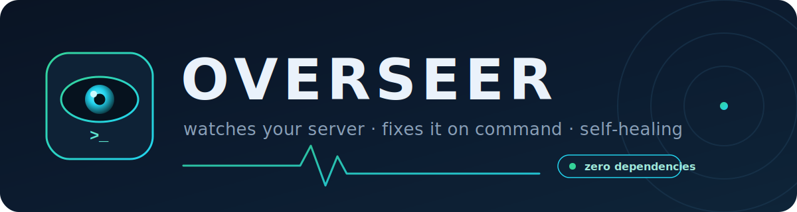
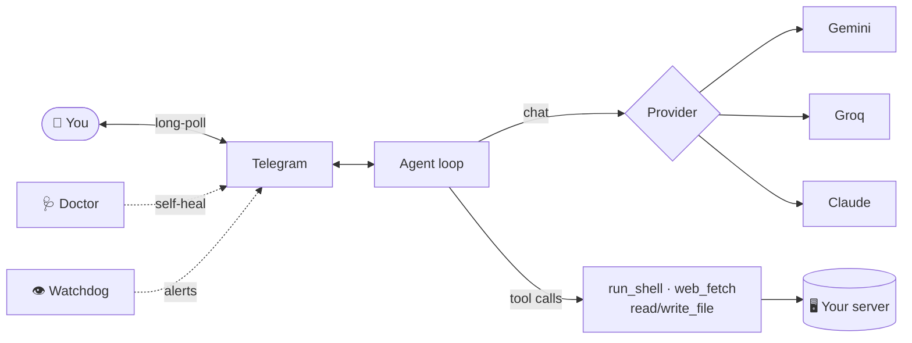

<p align="center">
  
</p>

<p align="center">
  <a href="LICENSE"></a>
  
  
  
</p>

**An AI agent that runs your server — and keeps watch over it.**

Overseer lives on your box, watches it around the clock, and pings you the moment something breaks. Need something done? Just text it — *"disk's full?"*, *"restart nginx"*, *"why's it slow?"* — and it runs the commands, checks the result, and reports back. No SSH, no remembering flags. Tiny enough (zero-dependency, pure Python stdlib) to sit on the smallest VPS without you noticing.

```
you:      anything failing?
overseer: nginx flapped 3× in the last hour — bad server block in a reload loop.
          Fixed it, reloaded clean. Quiet now. Also: disk's at 86%, want me to clear old logs?

you:      yeah do it
overseer: Cleared 4.2G of rotated logs + apt cache. Disk now 71%. 👍
```

---

## What it does

- **🖥️ Runs your server on command** — text a task in plain English; it runs the shell commands, verifies the outcome, and reports. Your server, one Telegram message away.
- **👁️ Keeps an eye on it 24/7** — a built-in watchdog proactively pings *you* when a service dies, disk fills, load spikes, or the box reboots. You hear about problems *before* you go looking.
- **🩺 Heals itself** — a doctor diagnoses failures (bad key, rate-limit, network) and DMs you the exact fix; it auto-recovers from provider rate-limits and oversized requests instead of falling over.
- **🔒 Stays in its lane** — locked to *your* Telegram id, won't touch services you mark protected, and confirms before anything destructive. Secrets stay `chmod 600`.

It's deliberately **small and focused** — not a do-everything personal assistant, but a **server operator you can text.**

## How's this different from OpenClaw & the others?

OpenClaw (and lean clones like Nanobot/ZeroClaw) are *general* AI assistants — calendar, browser, do-anything, 20+ channels, hefty footprint. Overseer does **one job well: watching and running your server** — in a **zero-dependency, ~12 MB** package that won't strain the box it's guarding. It also survives the real-world walls (rate-limits, Cloudflare blocks, oversized requests) by recovering instead of erroring. Where OpenClaw's been called a security "nightmare," Overseer is the small, careful, locked-down one.

## Install

On your VPS (Linux, Python 3.8+):

```bash
curl -fsSL https://raw.githubusercontent.com/0xenkil/overseer/main/install.sh | sh
overseer setup
```

`setup` is a guided 3-step wizard: pick a backend (it shows you exactly where to get the key), create a Telegram bot via [@BotFather](https://t.me/BotFather), and it **auto-detects your chat id** (just message the bot when it asks). Then it installs the 24/7 service. Done.

No git? Clone/copy the folder anywhere and run `python3 -m overseer setup`.

## Backends

Pick by friendly label (Fast / Smart / …) — you never touch a raw model id. Each has a built-in fallback chain + backoff, so a transient `429`/`503` won't kill a task.

| Backend | Key (free tier) | Notes |
|---|---|---|
| `gemini` | [aistudio.google.com](https://aistudio.google.com/apikey) | Easy, solid all-rounder. |
| `groq` | [console.groq.com](https://console.groq.com/keys) | Free + very fast (default: `gpt-oss-120b`). |
| `claude` | [console.anthropic.com](https://console.anthropic.com/settings/keys) | Strongest reasoning, paid. |

Switch backend or model anytime:

```bash
overseer provider
```

## Commands

```
overseer setup       guided first-time setup (creds, telegram, chat-id, install)
overseer install     install + start the systemd service
overseer doctor      full health checkup (telegram, LLM creds, disk, memory)
overseer status      service status
overseer provider    switch AI backend / model
overseer logs        tail the live logs
overseer start|stop|restart
```

In Telegram (the `/` menu lists them): `/status` · `/model` · `/provider` · `/setkey <provider> <key>` · `/stop` (abort a task) · `/new` · `/whoami` · `/help`. `/model` and `/provider` pop **tap-to-select buttons** — switch the model or backend with one tap, no typing. Drop in new API keys live with `/setkey`. Change models, swap backends, add keys **entirely from your phone** — no SSH, no restart.

## What the agent can do

- **run_shell** — bash as root
- **web_fetch** — pull any URL/API (HTML stripped)
- **write_file** / **read_file**

It chains these in a loop, verifying as it goes, before replying — and **auto-compacts** old tool output when a request gets too big for the model's token limit, so long multi-step tasks complete instead of erroring.

## Safety

- Runs commands **as root** and obeys whoever can message the bot — so it's **locked to your `allowed_chat_ids`**; everyone else is ignored.
- List your **`protected_services`** (e.g. `xray`, `tor`); the agent won't stop/reconfigure them — or do destructive/irreversible actions — without explicit confirmation.
- Secrets (`config.json`, state) are `chmod 600` and `.gitignore`d. Run it on a box you own.

## How it works



📐 **Full diagrams** — message flow, resilience/auto-recovery, the provider abstraction, and
the watchdog — are in **[docs/ARCHITECTURE.md](docs/ARCHITECTURE.md)**.

```
overseer/
  agent.py      telegram long-poll -> provider loop -> tools  (the runtime)
  providers.py  Gemini | Groq | Claude behind one interface (fallback + backoff + auto-compact)
  tools.py      run_shell, web_fetch, write_file, read_file
  doctor.py     health checks + failure diagnosis + self-healing alerts
  watchdog.py   proactive anomaly alerts (service down, disk, load, reboot)
  persona.py    the voice
  telegram.py   tiny Bot API client
  config.py     JSON config (+ env overrides)
  cli.py        guided setup wizard + service management
```

Each provider keeps the conversation in its own native format and exposes a uniform
`chat / user_turn / tool_results_turn / compact` surface, so the agent loop never has to
care which brain is plugged in.

## License

MIT © 2026 0xenkil
