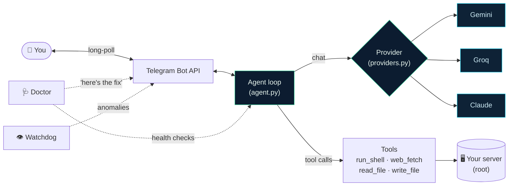
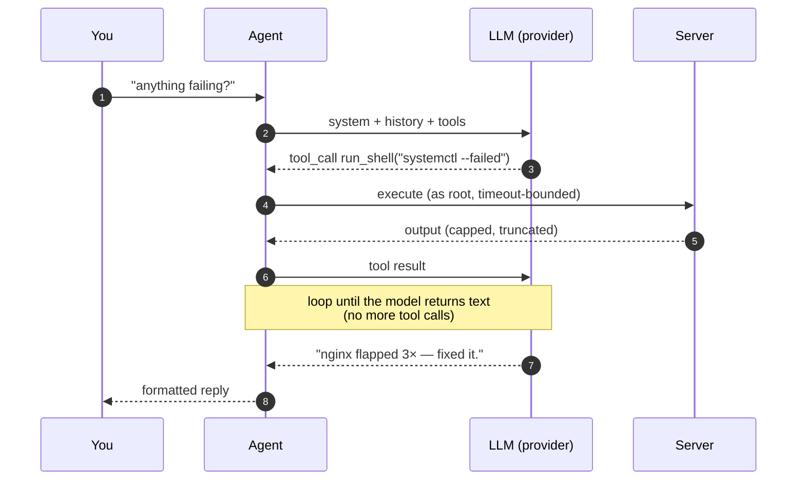
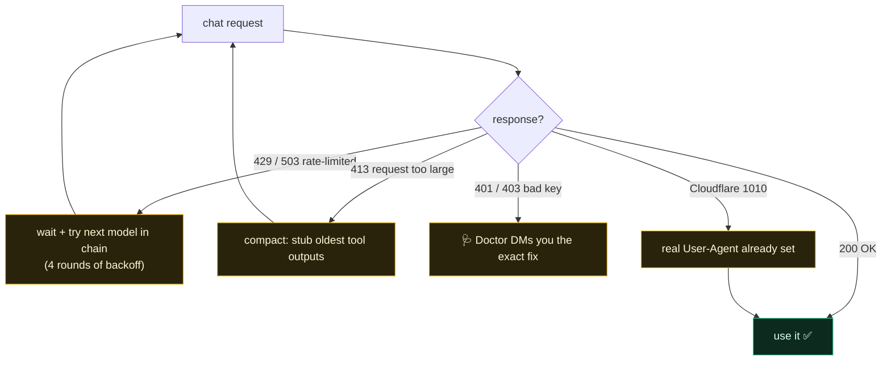
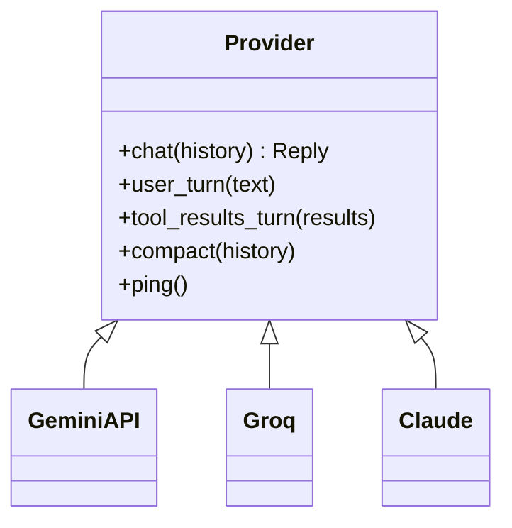
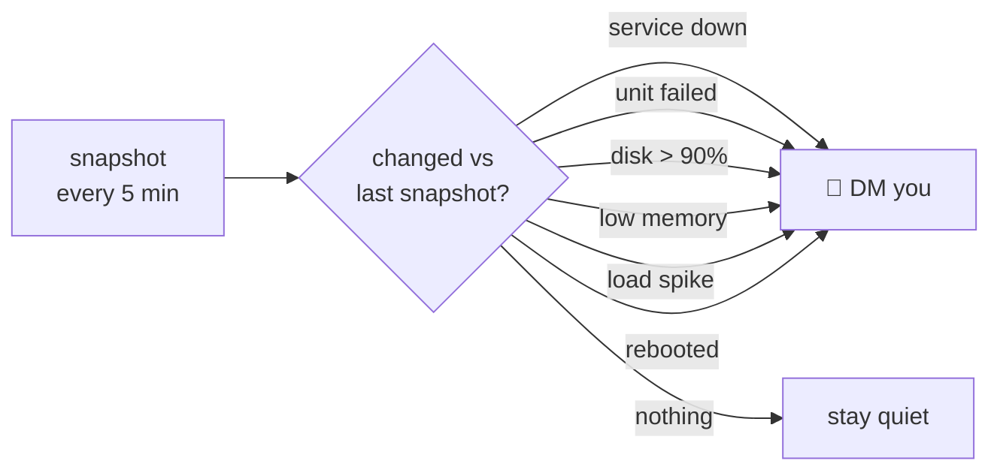

# Architecture

Overseer is a small, single-process Python agent (stdlib only). A Telegram long-poll
feeds a worker that runs an LLM tool-calling loop against your server, with a doctor and
a watchdog watching its back.

## System overview



- **agent.py** — the runtime: polls Telegram, queues messages to one serial worker, runs the tool loop, persists per-chat memory.
- **providers.py** — Gemini / Groq / Claude behind one interface, each speaking its own native tool-call format.
- **tools.py** — the four actions the agent can take on the box.
- **doctor.py / watchdog.py** — reactive self-healing + proactive alerts.

## How one message is handled



The loop repeats — the model can chain many tool calls (inspect → act → verify) before it
replies. Each round re-sends the conversation, so the model always reasons on fresh state.

## Resilience — why tasks don't just die

Free-tier LLM endpoints throw a lot of transient errors. The provider layer turns each into
a recovery, not a failure:



| Failure | What Overseer does |
|---|---|
| `429` / `503` (rate-limit / overload) | Back off and fall through the model chain (e.g. `gpt-oss-120b → 20b → llama-3.1-8b`). |
| `413` (request too large) | **Auto-compact** — stub the oldest tool outputs, keep recent ones, retry. Long tasks finish instead of erroring. |
| `401` / `403` (bad/expired key) | Doctor classifies it and DMs you the one-line fix. |
| Cloudflare `1010` (UA ban) | Every request carries a real browser User-Agent. |
| reasoning-model quirk | `reasoning` field is stripped from history before each send. |

## The provider abstraction

Every backend implements the same tiny surface, so the agent loop never branches on which
brain is plugged in:



Each keeps the conversation in its **own native format** (Gemini `functionCall`, OpenAI/Groq
`tool_calls`, Anthropic `tool_use`) — translation lives inside the provider, not the agent.

## Proactive watchdog

A background thread snapshots the box every few minutes and alerts you on **changes**, not
every tick (so no spam):



## Layout

```
overseer/
  agent.py      runtime: telegram poll → worker → tool loop → memory
  providers.py  Gemini | Groq | Claude (fallback + backoff + compact)
  tools.py      run_shell, web_fetch, read_file, write_file
  doctor.py     health checks + failure diagnosis + self-healing alerts
  watchdog.py   proactive anomaly alerts
  persona.py    system prompt / voice
  telegram.py   tiny Bot API client
  config.py     JSON config (+ env overrides)
  cli.py        guided setup wizard + service management
```
